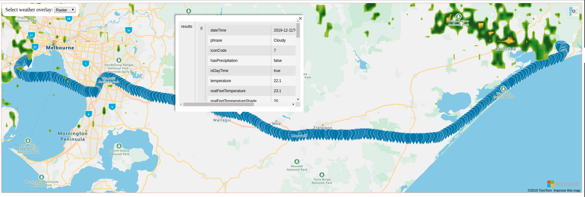

# Azure Maps rendering GeoJson

This code is used as a demo for the Azure Maps service to plot a GeoJson track onto an Azure Maps.

## Prerequisites

* Azure Maps Account
  * https://docs.microsoft.com/en-us/azure/azure-maps/how-to-manage-account-keys
  * this will likely incur cost, be aware!

Get the Azure Maps authentication key:
* https://docs.microsoft.com/en-us/azure/azure-maps/how-to-manage-authentication

## Deployment

Localise `<azureKey>` in `map.html` and replace it with your own authentication key from above.
Once done you can launch `map.html` in the browser of your choice.

## Usage

You can now drag and drop any `.geojson` file (example can be found in the `tracks` directory) and the track will be rendered on the map.
Click on any point on the track and it will show you the current weather at this coordinate.
There is also a weather overlay that shows radar/infrared weather.

